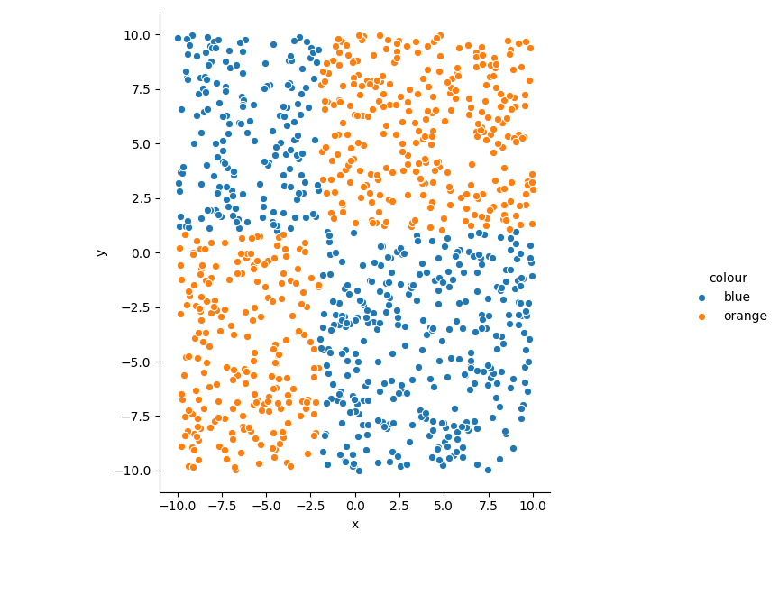

# Implementing A C4.5 Decision Tree Algorithm

A simple guide by Amélia O. F. da S.

---

* For the examples in this guide, I'll be using Python 3.X and the `pandas`, `numpy` and `math` modules.
* This guide's objective is not to implement an efficient or better algorithm, but to help people learn how decision trees work and grasp some important concepts more intuitively.

## Part *-1*: How this guide works

All the sections from part 1 on will be divided in 3 subsections.
* The first one describes that section's objective in unstructured natural language.
* The second one suggests a python-esque function structure in case you're having difficulty understanding the first section. `pd` refers to the `Pandas` module and `np` refers to `Numpy`.
* The last section is an example output using the second section's structure (and comments on that output).

The intended use for this guide is for the user to follow along using their favourite programming language. At the end of the main sections, the user will have a working C4.5 decision tree generator (with a fair performance on the iris dataset).

If they decide to follow the extra sections, the end result will be a simple bagging-based forest classifier (capable of tackling more complex problems, as demonstrated by the accent identification included there).

## Part 0: Entropy and impurity (Maths!)

### 0.1 - Understanding and measuring impurity

Consider a certain set `S` composed of `len(S)` items divided in `len(G)` classes `G[i]`.

There are many statistical tools we can use to determine how "impure" that set is, that is, how uncertain we are of the result we'd get by selecting a random item.

For this guide we'll be using *Entropy* as that measurement. Entropy is calculated as the opposite of the sum of the products between the relative frequencies of each class (`pr = len(G[i])/len(S)`) and the logarithm (base `n`) of that probablity (`logn(pr)`) - what a mouthful!.

That is, `Entropy(S) = - sum([ logn(pr) * pr  for pr in Class_Relative_Frequencies])`, with `Class_Relative_Frequencies = [len(class)/len(S) for class in G]`.

An interesting fact is that given a cetain set, whatever subsets you generate from it (e.g. by splitting it in half) will have an entropy equal to or lesser than the original set's.

### 0.2 (optional) - An intuitive way of understanding Entropy

A good way of internalising what that measurement means is by using a base 2 logarithm for its calculation. For that situation, Entropy can be interpreted in "bits". Intuitively, one can understand that as "How many bits one would need to describe all possible outcomes".

If we have two classes with the same relative frequency, we'll have `Entropy = -((1/2) * log2(1/2) + (1/2) * log2(1/2))`, which is equivalent to `Entropy = 1 (bit)`. That means we need 1 bit of information to describe items on that set (which is intuitively true, since we have 2 groups).

Using that interpretation, fractional entropies have a particularly interesting meaning. An example would be a set with 3 equally probable classes. `Entropy = -3*((1/3)*log2(1/3)) ≃ 1.58` (which can be represented as the table below).

|Bit 0|Bit 1|Class |
|:---:|:---:|:----:|
|    0|    0|First |
|    0|    1|Second|
|    1|  Any|Third |

Notice we're not using the "full space" those 2 bits allow us to. That's the intuition for fractional log2 entropies. They can be seen as meaning you need `ceil(entropy)` bits, but not all possible states will be used.

Fractional entropies can also happen when there's an imbalance on the frequencies of each group. If we have two classes, but one is much more frequent than the other, we'll obtain an entropy smaller than 1, even though there are 2 possible states (one bit). On this intuition, that just means that most of the times, that bit will be on a certain state, so in a similar way, "we don't use up its full space (uniformely)".

## Part 1: Implementing Set Entropy calculation

### 1.0 - Description

Implement a function that receives a set of point labels and calculates the entropy (using any logarithm) of that set.

### 1.1 - Function specification(s)

* `set_entropy(labels:pd.Series)->float`
    * Arguments:
        * `labels:pd.Series`: a list of labels for a set of data points
    * Output:
        * `float`: The entropy of that set.
    * Behaviour:
        * Applies the formulae described on part 0.1

### 1.2 - Example output

This is our dataset (`train.csv`):


It's nearly evenly split in two classes, so we should expect a value slightly smaller than 1 using a base 2 logarithm.

```python
>>> train = pd.read_csv("train.csv")
>>> set_entropy(train['colour'])
0.9944066525627802
```

## Part 2: Implementing Attribute Entropy calculation
### 2.0 - Description

Another useful measurement is "Attribute Entropy", which is given by the sum of the entropies of subsets (separated by an attribute) weighted by their relative frequency.

For understanding that better, let's consider the following table. It contains exclusively categorical attributes that describe a certain set of apples (tasty!).
| Country | Colour | Taste |
|:--------:|:------:|:------:|
|Brazil|green|sour|
|Chile|green|sour|
|Chile|green|sour|
|Chile|green|sweet|
|Panama|red|sour|
|Brazil|red|sweet|
|Brazil|red|sweet|
|Panama|red|sweet|


We'll consider the "Taste" column as our label. Its entropy is 1 bit (evenly divided in 2 classes).

How much less impure would our set be if we separeted it into subsets using each attribute? For that, we need to calculate each attribute's "Attribute Entropy".

Let's manually calculate the Attribute Entropy for "Country".

There are 3 subsets to be created: "Brazil", "Chile" and "Panama". Brazil has two sweet and one sour (thus 0.91 bit of entropy), Chile has one sweet and two sour (0.91 bit), Panama also has one sweet and one sour (1 bit).

Now we add up those values weighting them by their frequency. Brazil has 3/8, Chile has 3/8, Panama has 2/8 (1/4).

`Attribute Entropy(Country) = (0.91 * 3/8) + (0.91 * 3/8) + (1 * 1/4)`

`Attribute Entropy(Country) ≃ 0.93 bit`

As we can see, this attribute has an entropy really close to our original 1 bit. This means dividing our set into subsets using it doesn't make much difference in the impurity of the sets.

Let's do the same for "Colour":

Green has 3 sour and 1 sweet (`-(log2(3/4)*3/4) - (log2(1/4)*1/4) =` 0.81 bit). Red has the reverse (also 0.81 bit).

Both have the same frequency, so the Attribute Entropy is simply the mean value. Both values are equal, so

`Attribute Entropy(Colour) ≃ 0.81 bit`

That allows us to see that dividing our apples by colour is better than dividing them by country if we want to make their taste more predictable (green apples are indeed sourer in my experience).

That is the essence of this tree-generation algorithm.

Implement a function that receives a set of labels and a set of data points with a certain (categorical) attribute then outputs the Attribute Entropy for that attribute.

### 2.1 - Function specification(s)

* `attribute_entropy(data:pd.DataFrame,label_column:str,attribute:str)->float`
    * Arguments:
        * `data:pd.DataFrame`: The data set we're using as our reference.
        * `label_column:str`: The column we'll use as our labels
        * `attribute:str`: The column we'll use as our subset-generating attribute
    * Output:
        * `float`: The attribute entropy for this attribute.
    * Behaviour:
        * If the attribute is not categorical, return None or throw an error
        * Divides the labels in groups using the possible values of `data[attribute]`
        * Calculates each set's entropy
        * Returns the weighted sum of all entropies by their group's relative frequency

### 2.2 - Example output

```python
>>> apples = pd.read_csv("apples.csv")
>>> attribute_entropy(apples,'taste','country')
0.9387218755408671
```

## Part 3: Implementing non-categorical numerical Attribute Entropy calculation
### 3.0 - Description

The function described on part 2 can only deal with categorical attributes. How should we treat numerical non-categorical ones (e.g. the coordinates on `train.csv`)?

One solution is to simply establish a threshold and divide our set by it: the points with an attribute value lesser than or equal to the threshold go to one subgroup. The points greater than the threshold go to another.

From that point on, it's the same process as the categorical attribute calculation: you should calculate the entropies of each subset and calculate the weighted sum.

Implement a function that calculates a numerical attribute's entropy given a certain threshold.

After that, implement a function that finds the ideal threshold for minimising the attribute entropy for a certain attribute.

### 3.1 - Function specification(s)

* `num_attribute_entropy(data:pd.DataFrame,label_column:str,attribute:str,threshold:float)->float`
    * Arguments:
        * `data:pd.DataFrame`: The data set we're using as our reference.
        * `label_column:str`: The column we'll use as our labels
        * `attribute:str`: The column we'll use as our subset-generating attribute
        * `threshold:float`: The threshold we'll use for separating the subsets.
    * Output:
        * `float`: The attribute entropy for this attribute using that threshold.
    * Behaviour:
        * If the attribute is not numerical, return None or throw an error
        * Divides the labels in groups using the threshold (`< and >=` or `<= and >` - never forget the values equal to the threshold)
        * Calculates each set's entropy
        * Returns the weighted sum of all entropies by their group's relative frequency
* `minimum_num_attribute_entropy(data:pd.DataFrame,label_column:str,attribute:str)->tuple`
    * Arguments:
        * `data:pd.DataFrame`: The data set we're using as our reference.
        * `label_column:str`: The column we'll use as our labels
        * `attribute:str`: The column we'll use as our subset-generating attribute
    * Output:
        * `tuple`: A tuple containing `(minimum_entropy:float,threshold:float)`
            * `minimum_entropy:float`: The minimum entropy for this attribute
            * `threshold:float`: The threshold at which that entropy measurement happens. This will be useful in the next part.
    * Behaviour:
        * If the attribute is not numerical, return None or throw an error
        * Tests many possible thresholds with `num_attribute_entropy` to find the smallest one;
            * If you want an absolute minimum, you can use a brute-force method that uses all point values as the threshold value.
            * For a local minimum (and less processing time for big databases) you can start on the median and traverse on each direction until the entropy stops decreasing.

### 3.2 - Example output

Using `train.csv` again (refer to part 1 for a visual representation):

```
Num. Attribute Entropy (x at 0): 0.3714625098503106
Num. Attribute Entropy (y at 0): 0.9943479179070047
Output of minimum_num_attribute_entropy for x: (0.3714625098503106, -0.1628124)
Output of minimum_num_attribute_entropy for y: (0.9861247081468041, -2.7781863999999996)
```

Notice how splitting the dataset using the `x` attribute at 0 (or `-0.1628`) yields a much smaller entropy than the minimum entropy at y.

That is obvious for us humans looking at the graph: if we split it about halfway through with a vertical line (thus, dividing it on the x axis), the resulting sets are much purer!

This idea will be exactly what we'll use for deciding what (and where, if it's not categorical) is the best split we can do at a certain moment.

## Part 4: To split or not to split? (And where to split)
### 4.0 - Description

We're getting to the part where we finally start to see results that are actually interesting (beyond what would excite a mathematician or someone like me), just wait for it!

Using the functions described above, we can now tell what's the best possible split for any set. That's basically all we need. For that, we should calculate the attribute entropy for all attributes and see which one makes the biggest difference on the total entropy. That "difference" is called "information gain", and our objective is to maximise it at each split (making each split generate the biggest gain possible).

Implement a function that returns, for a certain set, what's the best possible split (attribute name and, if numerical, the threshold at which to split) and what is its gain.

Returning the gain is important because we'll use it as a stop condition further on. When we're generating a tree, it's not worth it to keep splitting the set if that split doesn't really bring us any new information (with a caveat. See below).

* Sometimes a split doesn't give us much information, but it allows for new splits that do give us very important gains. The dataset used in this section's example is a good illustration. The original set is almost evenly divided in 2 groups. After the first split, both sides are still divided evenly, but they're now able to be divided in perfectly separate groups.
* Generally, algorithms counteract that by making *all* possible splits, then doing something called "Pruning", which eliminates (from the bottom up) useless branches. That allows for avoiding overfitting without losing important splits.
* Pruning is not necessary, so I will not include it in the main sections. The extra sections will help you implement a pruning function, but in the main sections you'll obtain fairly good results using only an information gain threshold and a minimum depth (so your tree doesn't simply ignore the first branch and not do anything).

### 4.1 - Function specification(s)
* `best_split(data:pd.DataFrame,label_column:str)->tuple`
    * Arguments:
        * `data:pd.DataFrame`: The data set we're using as our reference.
        * `label_column:str`: The column we'll use as our labels
    * Output:
        * `tuple`: A tuple containing `(attribute:str,threshold:Union[float,NoneType],gain:float)`
            * `attribute:str`: The attribute at which the best split happens.
            * `thershold:Union[float,NoneType]`: If the attribute is non-categorical, the threshold. Otherwise, `None`
            * `gain:float`: The information gain for this split.
    * Behaviour:
        * Calculates the entropies for all attributes (except the label itself, of course)
        * Selects the one with the biggest gain
        * Returns the information specified above.
### 4.2 - Example output

Let's use the `trainq.csv` dataset.



Even for us humans it can be a bit hard to decide between the two obvious splits: x or y?

```python
>>> trainq = pd.read_csv("trainq.csv")
>>> best_split(trainq,'colour')
('y', 1.1492455, 0.0496319370885947)
```

Well that looks appropriate. "Y" axis, at about 1. Let's see how that looks:


If you're not excited by now, this topic is probably less interesting to you than it is to me, or you're probably learning this because it's mandatory. In that case, congratulations for making it so far! Otherwise, there's still more to come!

## Part 5: The tree!
### 5.0 - Description

We now know what to do when a dataset is thrown at us: split in a way we obtain the greatest information gain possible.

A decision tree does basically that, but recursively. It receives a dataset and splits it, then it splits the resulting datasets in the best possible way, and so on.

That's it. If you do literally just that, but with a training set, store that tree structure (splits and their children) and then throw in data from a test set, you can already classify things (and you'll see it does quite well already).

Implement a tree-generating function that takes as input a data set and the label column and outputs some data structure you can use to decide on new inputs later.

After that, implement a function that receives a data point and a tree and outputs its prediction (where that point lands in its divisions).

### 5.1 - Function specification(s)
* `generate_tree(data:pd.DataFrame,label_column:str,mindepth:int,info_thresh:float)->tuple`
    * Arguments:
        * `data:pd.DataFrame`: The data set we're using as our reference.
        * `label_column:str`: The column we'll use as our labels
        * `mindepth:int`: The minimum depth for the tree (up until which it ignores the minimum information gain threshold).
        * `info_trhesh:float`: The minimum information gain threshold. After the minimum depth, if the next split's gain is smaller than this, it'll stop splitting
    * Output:
        * `tuple`: A tuple containing `(attribute:str,threshold:Union[float,NoneType],children:dict)`
            * `attribute:str`: The attribute this split happens on. If the node is a leaf (see below), it's the predicted label.
            * `thershold:Union[float,NoneType]`: If the attribute is non-categorical, the point at which we split it
            * `children:dict`: A dictionary. If it points to `None`, this node is a leaf.
                * For categorical attributes, it will contain as keys all the possible values, pointing to tuples like this one.
                * For non-categorical attributes, it will contain as keys "lessereq" and "greater", pointing to tuples like this one (for the lesser/equal and greater than subsets).
    * Behaviour:
        * Finds the best split
        * If it's below the minimum depth and the split's gain is lesser than the minimum, stop and become a leaf.
            * For returning a leaf, the function will simply count the most frequent class on its subset and return `(class,None,None)`
        * Splits its set into subsets using the best split.
        * Calls itself for each resulting subset so it can populate `children:dict`
* `classify_point(point:pd.Series,tree:tuple)->str`
    * Arguments:
        * `point:pd.Series`: A data row
        * `tree:tuple`: A tree
    * Output:
        * `str`: The label for that row
    * Behaviour:
        * Applies the decision tree to the row.
### 5.2 - Example output

It's a bit hard to read text representations of trees, so here's a picture for `trainq.csv`


```
Split by "y" at 1.1492
If lesser than or equal to 1.1492:
        Split by "x" at -2.0787
        If lesser than or equal to -2.0787:
                Split by "y" at 0.8204
                If lesser than or equal to 0.8204:
                        It's orange
                Otherwise (y>0.8204):
                        It's blue
        Otherwise (x>-2.0787):
                It's blue
Otherwise (y>1.1492):
        Split by "x" at -2.0806
        If lesser than or equal to -2.0806:
                It's blue
        Otherwise (x>-2.0806):
                It's orange
```

It works! Theres a tiny sign of overfitting in the lower left corner (can you see that horizontal division and a tiny "blue" area?), but that's fair. That division has a high information gain on our training set and there's no way for us to eliminate it either by changing the parameters using the information we have so far.

If we apply the same algorithm for the `iris.csv` dataset, we can already extract decent results. On average, it has a 92.48% accuracy.

That's it for the main guide!

## Extra sections

There's a follow-up guide available at [this]('https://github.com/m3101/C4.5-Tree-Forest-Classifier-Implementation-Guide/tree/main/extra') link with a couple extra topics (pruning, forests and bagging).
* For some reason, the hyperlink is not rendering correctly on some markdown interpreters. If that's the case, here's the address:
   * https://github.com/m3101/C4.5-Tree-Forest-Classifier-Implementation-Guide/tree/main/extra

---

Made with <3 by Amélia O. F. da S. in a very tiresome day-long marathon.
Thanks for reading, and I hope it's been helpful!
