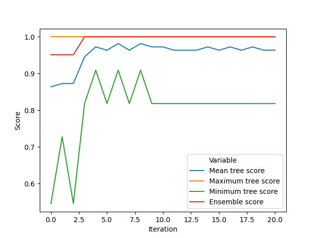
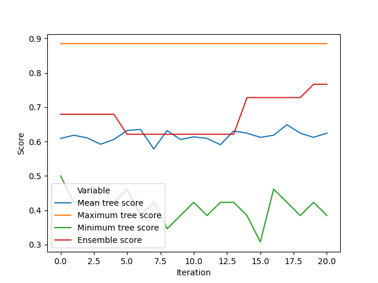

# Implementing Pruning and Ensemble Classifiers with Boostrap Aggregating (bagging)

A simple guide by Amélia O. F. da S.

---

* For the examples in this guide, I'll be using Python 3.X and the `pandas`, `numpy` and `math` modules.
* This guide's objective is not to implement an efficient or better algorithm, but to help people learn how decision trees work and grasp some important concepts more intuitively.
* This guide assumes you've read the main guide and uses the same structure. Refer to its `Part -1` for a structure description.

## Part 1: Tree pruning

### 1.0 - Description

If you followed the last guide and were curious enough to print the tree generated for the iris dataset (if not, uncomment the last `print_tree` statement on `Main_examples.py` for a shortcut), you may have noticed some branches have all their leaves with the same value. That means after that split, its children splits' information gain was not big enough to overcome our threshold *and* all subsets had the same class as a majority.

That kind of branch doesn't do much, and only has us doing an extra calculation that doesn't really change our end result. This is an example of a branch that should be pruned off and substituted by a single leaf.

Another problem we can solve by pruning branches off is overfitting. Sometimes a split can lead to information gain on a training set, but on a test set it's not important, or even ends up having us misclassify a few points (e.g. by splitting a group that should be uniform, like in `Part 5`, `5.2` of the main guide on the bottom left quarter of the image).

For solving that, we have two options:
* Score-based pruning
    * We count the tree's accurate classifications on a test set, remove the split and see whether that made it more accurate. If so, discard it; else, put it back on the tree.
* Entropy-based pruning
    * We do the same calculations we did for generating the tree, but using the test set as our reference for the entropy and information gain measurements; then we can simply use a threshold like we used on the generator function.

You can choose which one to implement.

Implement a pruning function that receives a tree, a test set and its labels as input and outputs a pruned tree.

You should implement two rules:
* Pruning nodes whose leaves all have the same class
* Pruning nodes either by score or entropy

If using score-based pruning, implement a function that receives a tree, a data set and its labels as input and outputs its score in classifying it.

### 1.1 - Function specification(s)

* (Optional) `tree_score(tree:tuple,data:pd.DataFrame,label_column:str)->float`
    * Arguments:
        * `tree:tuple`: A tree
        * `data:pd.DataFrame`: The data set we're using as our reference.
        * `label_column:str`: The column we'll use as our labels
    * Output:
        * `float`: That tree's score on this set (`accurate predictions/total`)
    * Behaviour:
        * Predicts the labels for all items on the set and compares them with the actual labels.
* `prune_tree(tree:tuple,data:pd.DataFrame,label_column:string)->tuple`
    * Arguments:
        * `tree:tuple`: A tree
        * `data:pd.DataFrame`: The data set we're using as our reference
        * `label_column:str`: The column we'll use as our labels
    * Output:
        * `tuple`: A pruned tree
    * Behaviour:
        * Using `data` as our test set, applies the techniques described on section `1.0`

### 1.2 - Example output

Using the `iris.csv` dataset, we can obtain an accuracy of approximately 93.57% without pruning. That tree has 5 splits.

By pruning by either entropy or score, we obtain a 3-split tree with 95.41% accuracy.

It's simple enough to apply manually to entries on the dataset:

```
Split by "petal-width" at 0.4
If lesser than or equal to 0.4:
        It's Iris-setosa
Otherwise (petal-width>0.4):
        Split by "petal-length" at 5.0
        If lesser than or equal to 5.0:
                Split by "petal-width" at 1.7
                If lesser than or equal to 1.7:
                        It's Iris-versicolor
                Otherwise (petal-width>1.7):
                        It's Iris-virginica
        Otherwise (petal-length>5.0):
                It's Iris-virginica
```

From this simplified tree we can even infer descriptions for the three different species there:
* Iris Setosa has thin petals
* Iris Virginica has long, wide petals
* Iris Versicolor has longer petals than Setosa, but shorter than Virginica, and a bit thinner.

## Part 2: Ensemble methods and Bagging

### 2.0 - Description

A single tree might be good at classifying points for a simple problem, but for more complex datasets a single tree might not be enough.

There's a way to make it work, though.

Similar to the idea of "Wisdom of the Crowd" in sociology, in machine learning, if we have enough weak (inaccurate or good-at-a-single-thing) classifiers working at the same task, we can obtain better results than each individual classifier could alone. That concept is called an "Ensemble classifier".

There are many ways of creating ensemble classifiers, from simple ensembles where one classifier is completely independent from the other (e.g. Bagging, which I'll explain below and we'll implement on this section) to ones where one classifier tries to compensate for the previous classifiers' weaknesses (Boosting) and other complex meta-algorithms.

For the sake of simplicity, on this section we'll implement a Bootstrap Aggregating (Bagging)-based ensemble classifier.

It might have a fancy name, but in practice it's a really simple idea:
* Step 1: We create many subsets from our training set by sampling it with replacement (that's called "Bootstrapping" or "Bootstrap sampling")
* Step 2: We train a weak classifier (our tree) on each of those subsets
* Step 3: We estimate the error by testing the tree on a different subset (out-of-bag error)
* Step 4(optional): We eliminate the classifiers with a high error and generate new ones until they're acceptable
* Post-training: For classifying a new point, we simply feed it into all classifiers individually and use some system to *Aggregate* (put together) those 'guesses'. Here we'll use simple voting. The class most trees indicate as the right one is what we'll use.

Generally, ensemble-fitting methods implement that fourth step, that is, they are iterative. Simply generating a fair amount of classifiers is already enough for a decent result, so you don't have to necessarily implement it. Doing so can help you extract some interesting data, though (like the graphs at `2.2`). The example implementation on `2.2` iterates until the deviation of the scores in relation to the maximum score within the ensemble is low enough.

Implement a function that receives as input a training set, a set of labels and generates a collection of trees using this method.

After that, implement a function that receives as input that collection of trees and a new data point then outputs a class prediction (by seeing what's the most common prediction within the ensemble).

### 2.1 - Function specification(s)
* `generate_forest(data:pd.DataFrame,label_column:str,forest_size:int,threshold_deviation:float)->list`
    * Arguments:
        * `data:pd.DataFrame`: The data set we're using as our reference
        * `label_column:str`: The column we'll use as our labels
        * `forest_size:int`: The amount of weak classifiers to be generated
        * `threshold_variance:float`: The maximum deviation from the maximum score we'll tolerate within our ensemble
    * Output:
        * `list`: A list of trees
    * Behaviour:
        * Separates the training set in subsets (Bootstrapping)
        * Generates the trees
        * Separates the training set in new, different (out-of-bag) testing subsets
        * Prunes the trees using the new testing subsets
        * Estimates the error for each tree using those new testing subsets
        * Eliminates the trees whose variance from the maximum is greater than the threshold.
        * Repeat the process until no trees are eliminated
        * Return the full forest
* `forest_classify(forest:list,point:pd.Series)->str`
    * Arguments:
        * `forest:list`: A forest
        * `point:pd.Series`: A data point
    * Output:
        * `str`: The predicted label
    * Behaviour:
        * Uses each tree in the forest to classify the point
        * Returns the most frequent result

### 2.2 - Example output

Firstly let's compare this implementation's results with the individual trees using the original iris dataset.

With 25 trees running until they're all near the maximum score or for 20 iterations, the ensemble scores about 93.57%, a bit more than the original results, but not by much. By analysing how the model evolved along the iterations we can better understand why that happens:



* The scores on this graph are estimated by testing each individual tree against a subset of the training data it wasn't trained on, so it might still be higher than the actual average score for the trees on a test set, as seen on the second image.

The score variance you can get by simply selecting a different training set is incredibly wide, as you can see by comparing the maximum tree score and the minimum tree score. Through bagging, we mitigate that problem by training on multiple subsets, reducing overfitting and score variance between sets. This gives us a more general result less prone to being overfit to that specific set or being influenced by its eventual nuances.

For the accent recognition dataset, the average individual tree score was 42.79% using a training set the same size as the ensemble's trees'. The forest's results were considerably higher this time: 54.86% by using 30% of the set as our training reference and 70% for testing. The graphs for this one are also very informative:



As the model evolves, the estimated ensemble score starts to climb above the mean tree score, showing how it can outperform the individual weak learners by "generalising" their knowledge about their small training set.

## That's it!

Thank you for reading (and potentially following along with code) so far!

I really hope this has been helpful in any way. I decided to make this guide after finding some little projects I worked on last year. Whenever I'm learning something new I try and apply that knowledge on simple projects, and that's been extremely helpful on consolidating that understanding and making it simultaneously deeper and more intuitive.

Most times, though, the knowledge necessary for actually applying theoretical ideas on practical projects is not as accessible as it should. Mathematical language and extreme formalisations are vry useful for academia, research and developing new ideas, but most people will spend much more energy decoding what's behind that than they should.

My intention with this guide (and potentially other future guides) is to try and reduce that gap a bit more. There are many other guides and references out there doing the same, and I really recommend checking them out if you want to keep learning about this and other topics.

## Acknowledgements

For section `2.2`'s example results, I used a dataset made available at the UCI Machine Learning repository. That specific dataset is available at:

* Fokoue, E. (2020). UCI Machine Learning Repository https://archive.ics.uci.edu/ml/datasets/Speaker+Accent+Recognition. Irvine, CA: University of California, School of Information and Computer Science.

Feel free to explore the other databases available there. It's a very interesting source for real-world problems of all levels of complexity.

---

Made with <3 by Amélia O. F. da S.
Thanks for reading, and I hope it's been helpful!